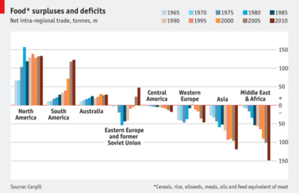
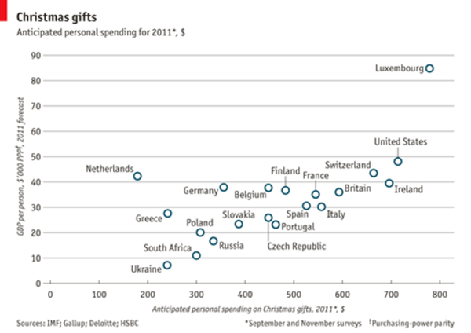

# Downloading data

## GDI (Graphic Design Importance) Dataset

Source of the image files and ground truth importance maps: http://www.dgp.toronto.edu/~donovan/layout/index.html

Training data (862 files):

  * file listing: [train.txt](http://visimportance.mit.edu/data/GDI/train.txt)
  * image files: [gd_train.zip](http://visimportance.mit.edu/data/GDI/gd_train.zip)
  * importance maps: [gd_imp_train.zip](http://visimportance.mit.edu/data/GDI/gd_imp_train.zip)

Validation data (216 files):

  * file listing: [valid.txt](http://visimportance.mit.edu/data/GDI/valid.txt)
  * image files: [gd_val.zip](http://visimportance.mit.edu/data/GDI/gd_val.zip)
  * importance maps: [gd_imp_val.zip](http://visimportance.mit.edu/data/GDI/gd_imp_val.zip)

Sample images and importance maps from the GDI dataset:

## Massvis (Visualization) Dataset

Source of the image files: http://massvis.mit.edu/
The ground truth importance maps for the Massvis images were collected specifically for this project, using the [BubbleView methodology](http://massvis.mit.edu/bubbleview).

Training data (1209 files):

* file listing: [train.txt](http://visimportance.mit.edu/data/massvis/train.txt)
* image files: [train.zip](http://visimportance.mit.edu/data/massvis/train.zip)
* importance maps: [train_imp.zip](http://visimportance.mit.edu/data/massvis/train_imp.zip)

Validation data (202 files):

* file listing: [valid.txt](http://visimportance.mit.edu/data/massvis/valid.txt)
* image files: [valid.zip](http://visimportance.mit.edu/data/massvis/valid.zip)
* importance maps: [valid_imp.zip](http://visimportance.mit.edu/data/massvis/valid_imp.zip)

Note: the file paths in the training files point to this directory, so you can download the data files to this location in your cloned repo.

