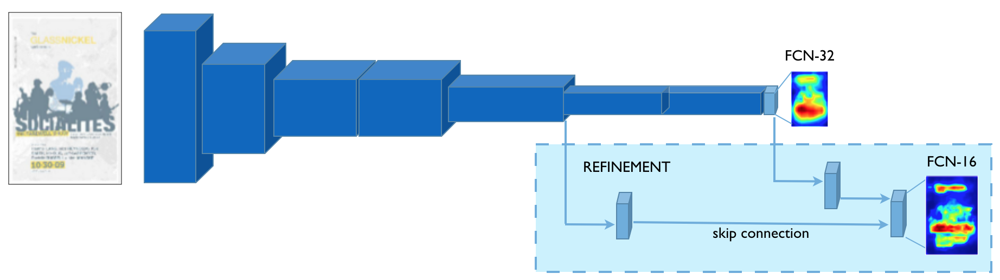

# Downloading models

## GDI (Graphic Design Importance)

  * FCN-32s: [gdi_fcn32.caffemodel](http://visimportance.mit.edu/data/GDI/gdi_fcn32.zip)
  * FCN-16s (final model): [gdi_fcn16.caffemodel](http://visimportance.mit.edu/data/GDI/gdi_fcn16.zip)

The FCN-32s model was initialized from the pre-trained [VOC-FCN32s](https://github.com/shelhamer/fcn.berkeleyvision.org/blob/master/voc-fcn32s/caffemodel-url) model.
The FCN-16s model was then initialized from the FCN-32s model. As specified in [fcn16/net.py](https://github.com/cvzoya/visimportance/blob/master/gdi/fcn16/net.py) it has an extra skip connection that was fine-tuned (all layers except score_sal and score_pool4 were frozen). This is the final model that we use for predicting graphic design importance.

Here is a depiction of what this architecture with a skip connection roughly looks like (the darker layers are fixed, the lighter layers are fine-tuned on the importance data):

## Massvis (Visualization)

  * FCN-32s: [massvis_fcn32.caffemodel](http://visimportance.mit.edu/data/massvis/massvis_fcn32.zip)

The FCN-32s model was initialized from the pre-trained [VOC-FCN32s](https://github.com/shelhamer/fcn.berkeleyvision.org/blob/master/voc-fcn32s/caffemodel-url) model. We found that adding skip connections did not improve performance on this dataset.
